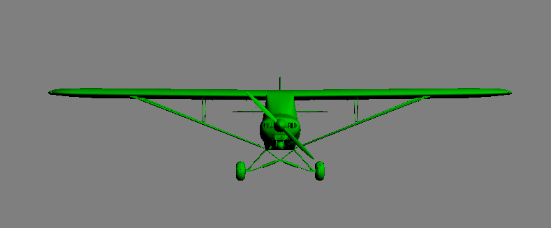

# Real-Time Animation Assignment 1 - Plane Rotation
The purpose of this assignment was to familiarise ourselves with orientation and rotational formats. The program was written in C++ using shader-based OpenGL. There were several features to implement, including:
- Simple representation of pitch, roll and yaw rotations using Euler Angles
- Observe gimbal-lock when two axes are aligned
- Overcome gimbal-lock using quaternions to represent rotations
- Hierarchical moving elements
- Switch between first and third-person views

Screenshot of the plane used in my program:

Link to video demonstrating the features listed above:
[CS7GV5 Assignment 1 - Plane Rotation](https://youtu.be/mFFI74RhtSU)
